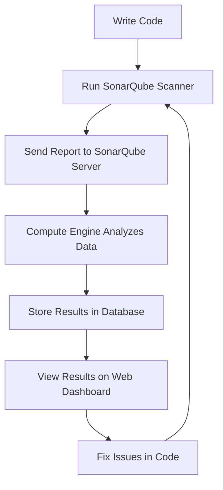

# SonarQube Documentation

> This documentation gives a simple and clear overview of **SonarQube**, an open-source tool for code quality inspection.

---

## Author Information

| Created by      | Created on  | Version | Last updated ON | Pre Reviewer |
|-----------------|------------|---------|-----------------|--------------|
| Kawalpreet Kour | 18-07-2025 | V 1.0   | 21-07-2025      | Pritam       |

---

## Table of Contents

1. [Purpose](#1-purpose)
2. [Scope](#2-scope)
3. [Prerequisites](#3-prerequisites)
4. [What is SonarQube?](#4-what-is-sonarqube)
5. [What SonarQube Does](#5-what-sonarqube-does)
6. [History & Background](#6-history--background)
7. [Architecture](#7-architecture)
8. [Workflow](#8-workflow)
9. [Key Features](#9-key-features)
10. [Benefits](#10-benefits)
11. [Limitations](#11-limitations)
12. [SonarQube Editions](#12-sonarqube-editions)
13. [Alternative Tools](#13-alternative-tools)
14. [Why SonarQube is Best](#14-why-sonarqube-is-best)
15. [Best Practices](#15-best-practices)
16. [FAQs](#16-faqs)
17. [Conclusion](#17-conclusion)
18. [References](#18-references)
19. [Contact Information](#19-contact-information)

---

## 1. Purpose
To give a clear understanding of SonarQube, its main features, how it works, and why you should use it for code quality.

## 2. Scope
Useful for developers, DevOps engineers, and QA teams working on software development.

---

## 3. Prerequisites

> - Java Installed  
> - Minimum Hardware Requirements  
> - Supported Database (e.g., PostgreSQL)  
> - Web Browser (Chrome/Firefox)  

---

## 4. What is SonarQube?
- Open-source tool for code quality inspection
- Supports 25+ languages (Java, Python, Go, etc.)
- Checks code coverage, duplication, bugs, security risks
- Works with CI/CD pipelines

## 5. What SonarQube Does
- Analyzes code without running it (static analysis)
- Enforces coding standards
- Gives dashboards for code health
- Finds bugs, vulnerabilities, and code smells
- Suggests improvements

## 6. History & Background
- Made in Java
- Started by SonarSource in 2007
- Was called "Sonar" first
- Built for "Continuous Inspection"
- Uses plugins for more features

---

## 7. Architecture

SonarQube architecture contains these main components:

- **Source Code**: Your project files (Java, C++, etc.)
- **Scanner**: Runs through command line, build tools (Maven/Gradle), or CI/CD (Jenkins, etc.) to scan the source code.
- **SonarQube Server**: Contains:
    - **Compute Engine**: Processes scan results.
    - **Webserver**: Displays results and dashboards.
    - **Search Server (Elasticsearch)**: Stores and searches data.
- **Database**: Stores all reports, snapshots, and configurations.

---

## 8. Workflow

Below is a simple workflow diagram for SonarQube usage:

**Workflow Steps:**
1. **Write Code:** Developers write code in any supported language.
2. **Run SonarQube Scanner:** Use CLI, Maven/Gradle, Jenkins, etc. to scan the code.
3. **Send Report to SonarQube Server:** Scanner sends analysis data to SonarQube server.
4. **Compute Engine Analyzes Data:** The compute engine processes the scan results.
5. **Store Results in Database:** All reports and metrics are stored.
6. **View Results on Web Dashboard:** Developers/teams review issues and metrics.
7. **Fix Issues in Code:** Developers resolve issues and repeat the workflow.

---

## 9. Key Features
- **Quality Profiles:** Set rules for scanning
- **Metrics:** Coverage, complexity, duplication
- **Static Code Analysis:** No need to run code
- **Quality Gates:** Pass/Fail based on set limits

## 10. Benefits
- Makes code better and cleaner
- Finds problems early
- Reduces future code issues (technical debt)
- Works well with CI/CD tools
- Supports many languages

## 11. Limitations
- Setup can be tough for beginners
- Does not find runtime errors
- Sometimes shows false positives
- Uses a lot of system resources

## 12. SonarQube Editions
- **Community Edition** – Free and open-source
- **Enterprise Edition** – Paid, has extra features

---

## 13. Alternative Tools

Some popular alternatives to SonarQube:
- **Veracode:** Focuses more on security, SAST, not free.
- **Checkmarx:** Security scanning for code, paid.
- **Codacy:** Code quality and coverage, supports many languages, SaaS.
- **Coverity:** Static analysis, paid, strong in security.
- **ESLint:** JavaScript/TypeScript linting (language-specific).
- **PMD:** Java static analysis.
- **FindBugs/SpotBugs:** Java static analysis.
- **Fortify:** Enterprise security scanning.
- **DeepSource:** Automated code review, multi-language.
- **Snyk:** Security scanning, open source vulnerabilities.
- **CodeClimate:** Automated code review and test coverage.

---

## 14. Why SonarQube is Best

- **Comprehensive Language Support:** 25+ languages, not limited to one ecosystem.
- **Integration:** Works with all major CI/CD tools (Jenkins, GitHub Actions, GitLab, Bitbucket, etc.).
- **Open Source:** Free Community Edition, active community, widely adopted.
- **Quality Gates:** Enforces minimum standards before merging code.
- **Customizable:** Rules, profiles, plugins, and dashboards can be tailored.
- **Developer Friendly:** Easy to use UI, actionable feedback, and clear dashboards.
- **Extensible:** Plugin-based, integrates with other tools and IDEs.
- **Continuous Inspection:** Designed for constant feedback, not just one-off scans.
- **Active Development:** Regular updates, strong support from SonarSource.
- **Good Documentation:** Rich official and community resources.

---

## 15. Best Practices
- Scan code early and regularly
- Pay attention to new code first
- Tweak quality profiles for different languages
- Always check quality gates
- Use with CI/CD like Jenkins

---

## 16. FAQs

**Q. What is SonarQube used for?**  
To check code quality and find issues before release.

**Q. Can SonarQube be integrated with CI/CD tools?**  
Yes, with Jenkins, GitLab, GitHub Actions, etc.

**Q. Is SonarQube free to use?**  
Community Edition is free. Enterprise Edition costs money.

---

## 17. Conclusion
SonarQube helps make sure your code is good, catches problems early, and fits well into software development workflows.

---

## 18. References

> - [SonarQube Fundamental Tutorial](https://youtu.be/UjCVCvdI73w?si=642Ocb0Ayo8tgNJV)  
> - [SonarQube Complete](https://youtu.be/r2UVTDpIUj8?si=WX7VgI1IBx-HbkGx)  
> - [Official SonarQube Documentation](https://docs.sonarqube.org/latest/)  

---

## 19. Contact Information

| Name             | Email                                         |
|------------------|-----------------------------------------------|
| Kawalpreet Kour  | Kawalpreet.kour.snaatak@mygurukulam.co        |

---
