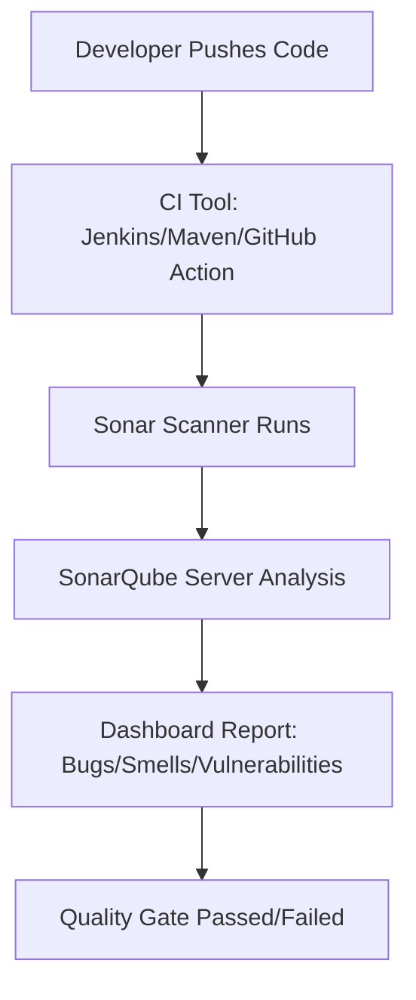

# 📘 SonarQube Documentation

A clear, step-by-step guide to install and use **SonarQube**, focused on code quality, security, and DevSecOps best practices.

---

| Authors           | Created on    | Version | Last updated by | Last edited on |
|-------------------|--------------|---------|-----------------|---------------|
| Kawalpreet Kour   | 19 July 2025 | v1      | -               | -             |


---
## 📑 Table of Contents

1. [What is SonarQube?](#what-is-sonarqube)
2. [Why Use SonarQube?](#why-use-sonarqube)
3. [Advantages](#advantages)
4. [Disadvantages](#disadvantages)
5. [Typical Workflow](#typical-workflow)
6. [Best Practices](#best-practices)
7. [Installation & Configuration Guide](#installation--configuration-guide)
    - [Prerequisites](#prerequisites)
    - [Installation Steps (Debian/Ubuntu)](#installation-steps-debianubuntu)
    - [Running Analysis](#running-analysis)
8. [SonarQube Editions](#sonarqube-editions)
9. [Conclusion](#conclusion)
10. [Contact](#contact)
11. [References](#references)

---

## 🧭 Scope

This guide covers:
- Installing SonarQube Community Edition (Linux/Debian/Ubuntu)
- Configuring SonarQube for your team/project
- Analyzing backend/frontend code quality
- Integrating with CI/CD (Jenkins, GitHub Actions)
- Enforcing quality gates & code standards (including OWASP)

---

## What is SonarQube?

SonarQube is an open-source platform by SonarSource for **continuous code quality inspection**.  
It automatically detects **bugs**, **vulnerabilities**, **code smells**, and **technical debt** across 25+ languages.

---

## Why Use SonarQube?

| Benefit                  | Explanation                                                      |
|--------------------------|------------------------------------------------------------------|
| Improve Code Quality     | Enforces clean, efficient coding practices                       |
| Catch Bugs Early         | Detects issues before production                                 |
| Secure Code              | Highlights security flaws (OWASP/CWE)                            |
| CI/CD Integration        | Works seamlessly with Jenkins, GitHub Actions, etc.              |
| Team Collaboration       | Tracks ownership and transparency of code issues                 |
| Reduce Technical Debt    | Measures and reports "cleanup" effort                            |

---

## Advantages

- ✔ Free Community Edition
- ✔ Multi-language (Java, Python, JS, etc.)
- ✔ Web dashboard & code coverage tracking
- ✔ Customizable rules & quality gates
- ✔ Easy integration with build tools (Maven, Gradle)

---

## Disadvantages

- ❌ High memory use (needs 4GB+ RAM)
- ❌ Advanced features require paid versions
- ❌ Setup and tuning require effort
- ❌ Branch/PR features limited in free edition

---

## Typical Workflow



---

## Best Practices

- ✅ Define and enforce quality gates
- ✅ Integrate SonarQube with CI/CD pipelines
- ✅ Regularly review and address reported issues
- ✅ Enable pull request decoration (paid version)
- ✅ Set up alerts for gate failures
- ✅ Use short-lived branch analysis (Developer+ editions)

---

## Installation & Configuration Guide

### Prerequisites

- Operating System: Ubuntu/Debian (Linux)
- Java 17+ installed (`sudo apt install openjdk-17-jdk`)
- RAM: Minimum 4GB (8GB+ recommended)
- Database: PostgreSQL/MySQL (recommended for production)
- Optional: Docker

---

### Installation Steps (Debian/Ubuntu)

```bash
# 1. Install Java 17 (if not already)
sudo apt update
sudo apt install openjdk-17-jdk

# 2. Download SonarQube (replace <version> with latest, e.g., 10.4.1)
wget https://binaries.sonarsource.com/Distribution/sonarqube/sonarqube-<version>.zip

# 3. Unzip
unzip sonarqube-<version>.zip
cd sonarqube-<version>/bin/linux-x86-64/

# 4. Start SonarQube server
./sonar.sh start

# 5. Access the Web UI
# Open: http://localhost:9000 (Default login: admin / admin)

# 6. (Optional) Set up PostgreSQL/MySQL and configure conf/sonar.properties
```

---

### Running Analysis

```bash
# 1. Install SonarScanner (CLI)
# Download from https://docs.sonarsource.com/sonarqube/latest/analyzing-source-code/scanners/sonarscanner/
# Or, on Ubuntu:
sudo apt install unzip
wget https://binaries.sonarsource.com/Distribution/sonar-scanner-cli/sonar-scanner-cli-<version>-linux.zip
unzip sonar-scanner-cli-<version>-linux.zip
export PATH=$PATH:$(pwd)/sonar-scanner-<version>-linux/bin

# 2. Run analysis (from project root)
sonar-scanner \
  -Dsonar.projectKey=my_project \
  -Dsonar.sources=. \
  -Dsonar.host.url=http://localhost:9000 \
  -Dsonar.login=<your_token>
```

---

## SonarQube Editions

| Edition       | Features                                           |
|---------------|----------------------------------------------------|
| Community     | Free, basic analysis                              |
| Developer     | Adds branch & PR analysis                         |
| Enterprise    | Governance, portfolios, multi-project dashboards  |
| Data Center   | High availability, clustering support             |

---

## Conclusion

**SonarQube** streamlines code quality and security for teams.  
It catches issues early, integrates with DevOps pipelines, and supports long-term technical health.

---

## Contact

| Name             | Email                                         |
|------------------|-----------------------------------------------|
| Kawalpreet Kour  | Kawalpreet.kour.snaatak@mygurukulam.co        |

---

## References

- [SonarQube Docs](https://docs.sonarsource.com/sonarqube/latest/)
- [SonarScanner Setup](https://docs.sonarsource.com/sonarqube/latest/analyzing-source-code/scanners/)
- [OWASP Top 10](https://owasp.org/www-project-top-ten/)
- [SonarQube GitHub](https://github.com/SonarSource/sonarqube)
